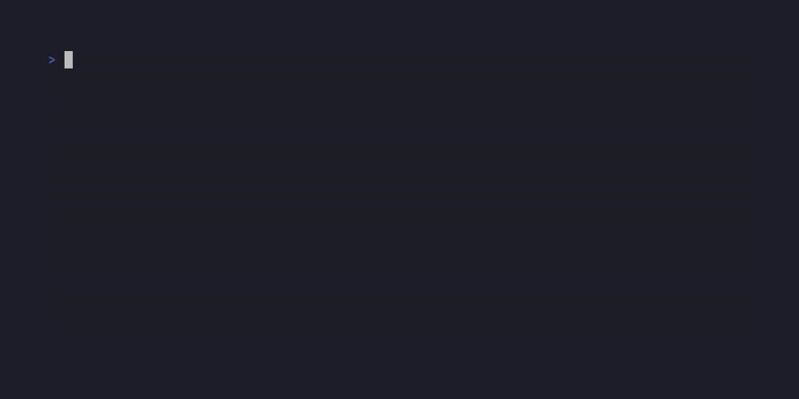

# Guessing Game


A terminal number-guessing game. The program picks a secret number between
`1` and `100`, and you guess until you find it.

## Table of contents

- [Features](#features)
- [Requirements](#requirements)
- [Usage](#usage)
- [Development](#development)
- [Project structure](#project-structure)
- [Design notes](#design-notes)
- [Project origin](#project-origin)

## Features

- Secret number sorted uniformly between `1` and `100`
- Guess as many times as you need -- the game tells you if you're too low
  or too high
- Non-numeric or negative input is rejected with a friendly warning instead
  of crashing or failing silently
- Semantic-colored terminal output (Rich): yellow for an invalid guess, red
  for too low/too high, green for the win

## Requirements

- Python 3.12+
- [uv](https://docs.astral.sh/uv/)

## Usage

```bash
git clone https://github.com/carvalhocaio/guessing_game.git
cd guessing_game
uv run guessing-game
```



> The GIF above is generated with [VHS](https://github.com/charmbracelet/vhs)
> from [`assets/demo.tape`](assets/demo.tape). Regenerate it locally with
> `vhs assets/demo.tape` (requires VHS <= 0.11.0 -- 0.12.0 has a rendering
> regression that silently produces no output).

## Development

```bash
uv sync                    # install runtime + dev dependencies
uv run pytest -v           # run tests
uv run ruff check .        # lint
uv run ruff format .       # format
pre-commit install         # install the git hook (runs ruff on every commit)
```

Or the equivalent `make` shortcuts:

```bash
make sync
make test
make lint
make format
make check   # lint + format-check + test, the aggregate gate
```

## Project structure

```
src/guessing_game/
├── __main__.py                # composition root -- all wiring happens here
├── domain/                    # pure models: no I/O
│   └── game.py                  # Outcome, judge()
├── application/                # use-case orchestration
│   └── game_service.py           # GameService
└── infrastructure/
    └── cli/
        ├── output.py              # Rich-based message formatting
        └── session.py             # stdin loop, the only layer touching the console
```

## Design notes

Dependencies point inward: `cli → application → domain`, and `domain`
depends on nothing. `GameService` owns the secret number and accepts it as
a constructor argument, which is what makes the game deterministic and
testable without any mocking. There's no `errors.py` or repository/port
layer here, unlike larger projects built the same way -- this game has no
real error condition (invalid input is handled inline, not raised) and no
persistence, so those layers would be abstraction without a use.

## Project origin

This is a Python rewrite of a small Rust learning project (the classic
guessing game from *The Rust Book*, chapter 2): generate a secret number,
read guesses in a loop, tell the player too low/too high/correct. The
rewrite keeps the exact same game rules and adds the tooling and layering
conventions (uv, Rich, pytest, ruff, pre-commit, domain/application/
infrastructure separation) from another personal project,
[cost-cap-tracker](https://github.com/carvalhocaio/cost-cap-tracker).
